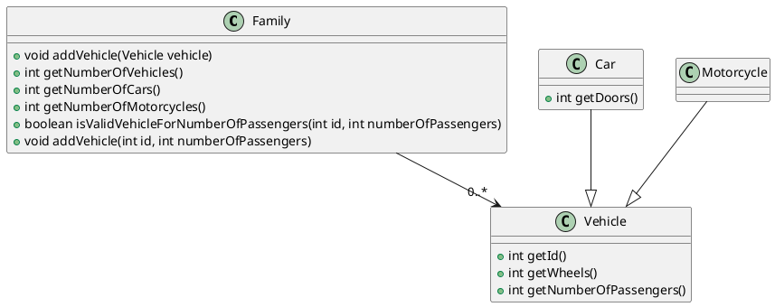

UML

```plantuml
@startuml

class Family {
 +  void addVehicle(Vehicle vehicle)
 + int getNumberOfVehicles()
 + int getNumberOfCars()
 + int getNumberOfMotorcycles()
 + boolean isValidVehicleForNumberOfPassengers(int id, int numberOfPassengers)
 + void addVehicle(int id, int numberOfPassengers)

}
class Vehicle {
    +int getId()
    +int getWheels()
    +int getNumberOfPassengers()
}
class Car {
    +int getDoors()
}
class Motorcycle

Family --> "0..*" Vehicle
Car --|> Vehicle
Motorcycle --|> Vehicle

@enduml
```
